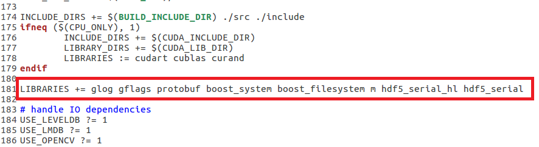

# Ubuntu enviroment set up

系统配置：

（1）Ubuntu-16.04.3-desktop-amd64

（2）GTX1050Ti

     
# 安装过程
## 1.安装依赖库

    sudo apt-get install build-essential python-pip vim gedit cmake git 

    sudo apt-get install libprotobuf-dev libleveldb-dev libsnappy-dev libhdf5-serial-dev

    sudo apt-get install libgflags-dev libgoogle-glog-dev liblmdb-dev

    sudo apt-get install --no-install-recommends libboost-all-dev

    sudo apt-get install libopenblas-dev liblapack-dev libatlas-base-dev

    sudo apt-get install libgflags-dev libgoogle-glog-dev liblmdb-dev

## 2.安装NVIDIA驱动

2.1 下载显卡驱动

通过http://www.nvidia.com/Download/index.aspx?lang=en-us查询显卡驱动，笔者显卡为GTX1050Ti。

图1 NVIDIA显卡查询

下载对应显卡驱动文件：NVIDIA-Linux-x86_64-384.98.run。

图2 显卡驱动下载

2.2 禁止Ubuntu自带的显卡驱动

    sudo gedit /etc/modprobe.d/blacklist.conf

在最后一行加入如下命令，禁止系统自带的显卡驱动

    blacklist nouveau

刷新配置

    sudo update-initramfs -u

2.3 安装显卡驱动

使用键盘Ctrl+Alt+F1~F6，先切换到黑屏文字界面，键入用户名和密码。

安装显卡驱动前，先禁止系统显卡显示。

    sudo service lightdm stop

切换到下载的显卡驱动文件夹后，进行安装。

    sudo chmod 777 NVIDIA-Linux-x86_64-384.98.run

    sudo ./NVIDIA-Linux-x86_64-384.98.run

重新使能系统显示，如显卡成功安装，显示器已经正常显示了。

    sudo service lightdm start

查询显卡信息，可输入

    sudo nvidia-smi

图3 显卡查询信息

## 3.安装CUDA

3.1 下载CUDA安装

通过https://developer.nvidia.com/cuda-toolkit-archive 下载cuda，

图4 CUDA下载选择界面

最新的CUDA是9.x版本，如需安装，下载对应版本即可，安装步骤一致。

选择CUDA Toolkit 8.0 GA2得到安装包和补丁文件，cuda_8.0.61_375.26_linux.run cuda_8.0.61.2_linux.run。

图5 CUDA下载界面

切换到下载文件所在路径，执行安装文件cuda_8.0.61_375.26_linux.run cuda_8.0.61.2_linux.run。

    sudo chmod 777 cuda_8.0.61_375.26_linux.run cuda_8.0.61.2_linux.run

    sudo ./cuda_8.0.61_375.26_linux.run

    sudo ./cuda_8.0.61.2_linux.run

注意：执行后会有一系列提示让你确认，但是注意，有个让你选择是否安装nvidia367驱动时，要选择否：

Install NVIDIA Accelerated Graphics Driver for Linux-x86_64 367.48?

不需要安装，其余的都直接默认或者选择是即可。

3.2 配置环境变量

    sudo gedit ~/.bashrc

在最后添加环境变量如下：

    export PATH=/usr/local/cuda-8.0/bin${PATH:+:${PATH}}

    export LD_LIBRARY_PATH=/usr/local/cuda-8.0/lib64${LD_LIBRARY_PATH:+:${LD_LIBRARY_PATH}}

配置生效：

    source ~/.bashrc

3.3 测试CUDA例子

    cd /usr/local/cuda-8.0/samples/1_Utilities/deviceQuery

    sudo make

    sudo ./deviceQuery

如正常安装，可显示显卡的信息。

图6 显卡查询信息

## 4.添加cuDNN库

cuDNN（CUDA Deep Neural Network），相比标准的cuda，它在一些常用的神经网络操作上进行了性能的优化，比如卷积，pooling，归一化，以及激活层等等，添加cuDNN库后可加速训练，建议安装。

通过https://developer.nvidia.com/rdp/cudnn-download 界面下载cuDNN库，需要注册NVIDIA开发者账号。

图7 CUDNN下载界面

选择CUDA8.0对应的cuDNN v7.0.5，选择下载进行配置，复制相应文件到系统库文件夹下。

    sudo tar -zxvf cudnn-8.0-linux-x64-v7.tgz

    cd cuda/include 

    sudo cp cudnn.h /usr/local/cuda/include 

    cd ../lib64 

    sudo cp lib* /usr/local/cuda/lib64/

复制后，软链接会丢失，重新建立软链接。

    cd /usr/local/cuda/lib64/

    sudo rm -rf libcudnn.so libcudnn.so.7 

    sudo ln -s libcudnn.so.7.0.5 libcudnn.so.7

    sudo ln -s libcudnn.so.7 libcudnn.so   

## 5.安装OPENCV3.3

安装opencv依赖包

    sudo apt-get install build-essential

    sudo apt-get install cmake git libgtk2.0-dev pkg-config libavcodec-dev libavformat-dev libswscale-dev

    sudo apt-get install python-dev python-numpy libtbb2 libtbb-dev libjpeg-dev libpng-dev libtiff-dev libjasper-dev libdc1394-22-dev

    sudo apt-get install libavcodec-dev libavformat-dev libswscale-dev libv4l-dev liblapacke-dev

    sudo apt-get install libxvidcore-dev libx264-dev

    sudo apt-get install libatlas-base-dev gfortran

    sudo apt-get install ffmpeg

安装OPENCV库，由于启用了CUDA功能，编译非常缓慢，耐心等待。

    sudo git clone https://github.com/opencv/opencv.git

    cd opencv/

    mkdir build

    cd build

    sudo cmake -D CMAKE_BUILD_TYPE=Release -D CMAKE_INSTALL_PREFIX=/usr/local ..

    sudo make -j8

    sudo make install

再运行

    sudo ldconfig
    
刷新opencv动态链接库。

查看opencv安装状态

    pkg-config --modversion opencv

输出
    
    3.3.0

## 6.安装Caffe

6.1 下载Caffe源码

    git clone https://github.com/BVLC/caffe.git

6.2 选择配置文件

    cd caffe/

    cp Makefile.config.example Makefile.config

6.3 根据需求修改配置文件

    sudo gedit Makefile.config

需要配置和修改的地方如下：

（1）使用USE_CUDNN

（2）使用USE_OPENCV

（3）使用OPENCV_VERSION := 3

图8 Caffe配置文件修改

（4）修改python包目录

PYTHON_INCLUDE := /usr/include/python2.7\

        /usr/lib/python2.7/dist-packages/numpy/core/include

修改为

PYTHON_INCLUDE := /usr/include/python2.7\

        /usr/local/lib/python2.7/dist-packages/numpy/core/include
        

图9 Caffe配置文件修改

（5）使用WITH_PYTHON_LAYER := 1

（6）Caffe中的数据库需要hdf5支持，添加hdf5库，

INCLUDE_DIRS := $(PYTHON_INCLUDE) /usr/local/include /usr/include/hdf5/serial/

图10 Caffe配置文件修改

添加了hdf5库后，还需在Makefile文件中添加库文件，如下所示

    sudo gedit Makefile

LIBRARIES +=glog gflags protobuf boost_system boost_filesystem m hdf5_serial_hl hdf5_serial

图11 hd5库添加

6.4 逐步编译Caffe源码

    sudo make all -j8

    sudo make test

    sudo make runtest

    sudo make pycaffe

如成功配置，则所有部分顺利编译和测试通过，亲测！

6.5 安装pyCaffe所需的库文件

    cd python/

    sudo pip install -r requirements.txt

安装过程中，可能出现pip版本过低的提示，升级pip版本

    sudo pip install --upgrade pip

查看caffe库的使用

    python

    import caffe

如下图python引入pycaffe时，出现没有caffe库的错误提示时，需要在系统环境变量中添加。

图12 pycaffe库引入错误

在~/.bashrc中添加环境变量：

export LD_LIBRARY_PATH=/home/XXX/caffe/python/caffe${LD_LIBRARY_PATH:+:${LD_LIBRARY_PATH}}

到这一步，成功完成Caffe所有环境的安装，可以进行Caffe相关的开发了！！

# 参考文档：

[1]http://www.linuxidc.com/Linux/2016-12/138870.htm

[2]http://www.linuxidc.com/Linux/2015-07/120449.htm

[3]http://blog.csdn.net/xuzhongxiong/article/details/52717285

[4]http://caffe.berkeleyvision.org/installation.html

[5]http://blog.csdn.net/goofysong/article/details/52116265

